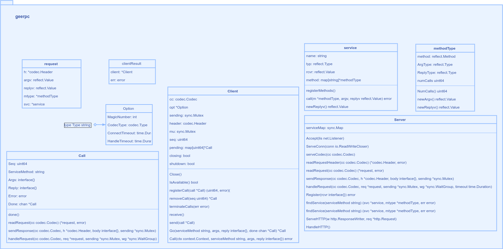
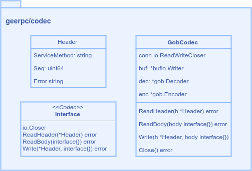
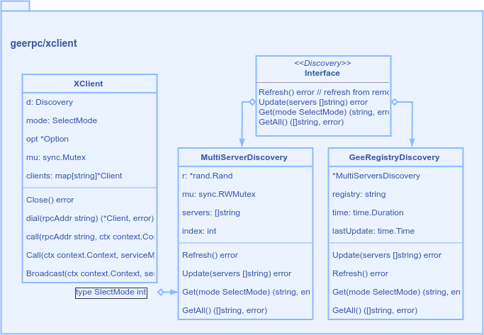
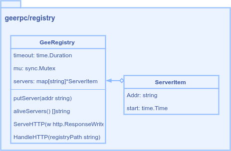

# gee-cache
learn base framework form [geektutu](https://geektutu.com/post/geerpc.html) 7-days series

client & server

communication codec

the client support load balance

service registry

TODO
- [ ] filfull doc  